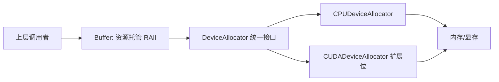

# 内存分配与释放设计笔记（当前分支）

## High Level 设计
目标：调用方只依赖统一接口与资源托管，不关心设备细节与释放时机。



关键思想：
- **接口一致性**：`allocate/release/memcpy` 的签名固定，上层不用做设备分支。
- **所有权清晰**：Buffer 明确“是否拥有内存”，避免忘记释放与悬空指针。
- **扩展友好**：新增设备仅需实现 Allocator 子类，不改 Buffer 调用层。

## 统一接口：DeviceAllocator 的设计意图
DeviceAllocator 是“资源操作层”，只干三件事：申请、释放、拷贝。
它不负责生命周期，这一点交给 Buffer。这样职责清晰、组合自由。

```cpp
class DeviceAllocator {
 public:
  explicit DeviceAllocator(DeviceType device_type) : device_type_(device_type) {}
  virtual DeviceType device_type() const { return device_type_; }

  virtual void release(void* ptr) const = 0;
  virtual void* allocate(size_t size) const = 0;
  virtual void memcpy(const void* src_ptr, void* dest_ptr, size_t size) const = 0;

 private:
  DeviceType device_type_ = DeviceType::kDeviceUnknown;
};
```

深层含义：
- **抽象层次**：Allocator 是“设备操作”，Buffer 是“生命周期管理”。
- **最小接口**：只保留必需操作，避免在 allocator 里夹杂上层逻辑。
- **设备标识**：`device_type_` 让 Buffer 做一致性校验（比如拷贝时必须同设备）。

## CPU 侧实现细节（当前分支）
CPU allocator 不是简单 `malloc/free`，还有对齐策略。

```cpp
void* CPUDeviceAllocator::allocate(size_t byte_size) const {
  if (!byte_size) {
    return nullptr;
  }
#ifdef KUIPER_HAVE_POSIX_MEMALIGN
  void* data = nullptr;
  const size_t alignment = (byte_size >= size_t(1024)) ? size_t(32) : size_t(16);
  int status = posix_memalign((void**)&data,
                              ((alignment >= sizeof(void*)) ? alignment : sizeof(void*)),
                              byte_size);
  if (status != 0) {
    return nullptr;
  }
  return data;
#else
  void* data = malloc(byte_size);
  return data;
#endif
}
```

对齐策略的意义：
- **性能考虑**：16/32 字节对齐有利于 SIMD 加速与缓存友好性。
- **安全考虑**：`posix_memalign` 失败直接返回 `nullptr`，调用方能感知失败。

释放与拷贝：
```cpp
void CPUDeviceAllocator::release(void* ptr) const {
  if (ptr) {
    free(ptr);
  }
}

void CPUDeviceAllocator::memcpy(const void* src_ptr, void* dest_ptr, size_t size) const {
  CHECK_NE(src_ptr, nullptr);
  CHECK_NE(dest_ptr, nullptr);
  if (!size) {
    return;
  }
  std::memcpy(dest_ptr, src_ptr, size);
}
```

注意点：
- `CHECK_NE` 提前拦截非法指针，避免 silent crash。
- `size==0` 直接返回，避免对空数据做无意义操作。

## Buffer：资源生命周期的核心
Buffer 的核心在于“所有权模型”，而不是简单封装指针。

字段语义：
- `byte_size_`：内存大小，所有 copy/allocate 都依赖它。
- `ptr_`：裸指针，实际资源地址。
- `use_external_`：关键标志位，决定是否释放。
- `allocator_`：来源与释放策略的承载体。
- `device_type_`：用于设备一致性校验。

### 构造逻辑（决定是否自动申请）
```cpp
Buffer::Buffer(size_t byte_size, std::shared_ptr<DeviceAllocator> allocator, void* ptr,
               bool use_external)
    : byte_size_(byte_size),
      allocator_(allocator),
      ptr_(ptr),
      use_external_(use_external) {
  if (!ptr_ && allocator_) {
    device_type_ = allocator_->device_type();
    use_external_ = false;
    ptr_ = allocator_->allocate(byte_size);
  }
}
```

解读：
- **外部指针优先**：如果传了 `ptr`，不会再分配。
- **allocator + 空 ptr**：说明 Buffer 自管内存，会自动申请。
- **device_type_** 只在自管内存时设置，保证拷贝校验来源可靠。

### 析构逻辑（决定是否释放）
```cpp
Buffer::~Buffer() {
  if (!use_external_) {
    if (ptr_ && allocator_) {
      allocator_->release(ptr_);
      ptr_ = nullptr;
    }
  }
}
```

解读：
- **use_external_ 是分界线**：外部内存永不释放。
- **allocator_ 必须存在**：释放策略来源于 allocator。
- **指针置空**：减少悬空指针风险（debug 友好）。

### 手动申请（延迟分配）
```cpp
bool Buffer::allocate() {
  if (allocator_ && byte_size_ != 0) {
    use_external_ = false;
    ptr_ = allocator_->allocate(byte_size_);
    if (!ptr_) {
      return false;
    } else {
      return true;
    }
  } else {
    return false;
  }
}
```

适用场景：
- 先创建 Buffer 对象，再根据条件决定是否分配。
- 与外部指针模式互斥：调用后即视作自管。

### 拷贝语义（同设备强约束）
```cpp
void Buffer::copy_from(const Buffer& buffer) const {
  CHECK(allocator_ != nullptr && buffer.allocator_ != nullptr);
  CHECK(this->device_type() == buffer.device_type());

  size_t copy_size = byte_size_ < buffer.byte_size_ ? byte_size_ : buffer.byte_size_;
  return allocator_->memcpy(this->ptr_, buffer.ptr_, copy_size);
}
```

关键解读：
- **强制同设备**：防止 CPU/GPU 混拷贝。
- **拷贝最小尺寸**：避免越界读取/写入。
- **allocator 决定拷贝方式**：Buffer 不负责细节。

## 典型使用路径（含生命周期解释）

### 1) Buffer 自管内存（最常用）
```cpp
auto alloc = base::CPUDeviceAllocatorFactory::get_instance();
Buffer buffer(32, alloc);
CHECK_NE(buffer.ptr(), nullptr);
```

生命周期：
1. 构造时 `allocate(32)`
2. 退出作用域自动 `release(ptr)`

### 2) Buffer 借用外部指针
```cpp
float* ptr = new float[32];
Buffer buffer(32, nullptr, ptr, true);
CHECK_EQ(buffer.is_external(), true);
delete[] ptr;
```

生命周期：
1. Buffer 只是“借用”，不负责释放。
2. 外部负责 `delete[]`。

## 设计要点与潜在坑
- **allocator 与 ptr 一致性**：如果传了 `ptr` 但 `use_external=false`，析构会尝试释放；因此外部指针场景必须显式 `use_external=true`。
- **device_type_ 设置时机**：当前只在自管内存时设置；外部指针若想拷贝，需要调用 `set_device_type`。
- **copy_from 方向**：`Buffer::copy_from(const Buffer&)` 使用 `this` 的 allocator；设备一致性是硬要求。

## 当前分支边界与扩展位
- 仅实现 `DeviceType::kDeviceCPU`。
- GPU allocator 尚未接入，但接口已留好：新增 `CUDADeviceAllocator` 即可接入现有 Buffer。
- `memcpy` 目前只有 CPU 版本，后续可以扩展为多方向/异步拷贝。
